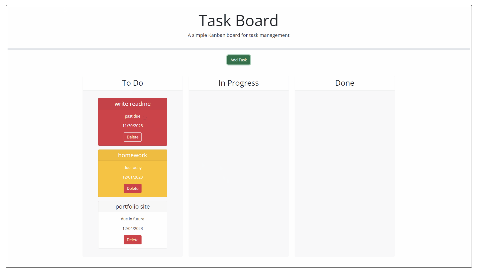

#kanban

Description:
We were tasked in our BootCamp to create a task baord from starter code using HTML, CSS, & JS.

Usage:
To use the skills we've learned in class to build a kanbanboard from starter code using our current knowledge.

Credits:
W3Schools MDN Web Docs freecodecamp.org

License:
N/A
